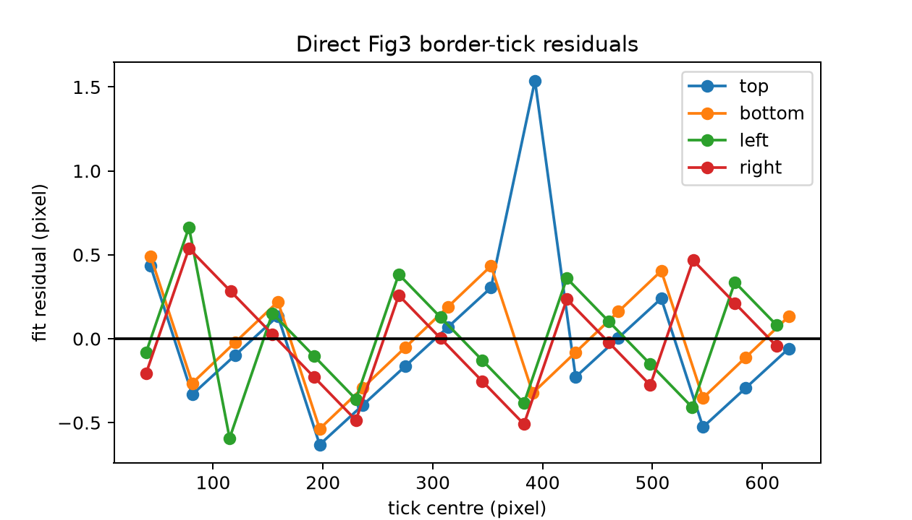
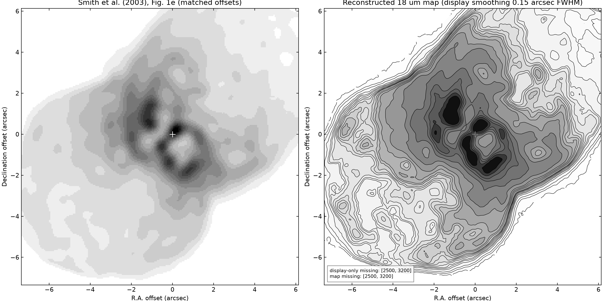
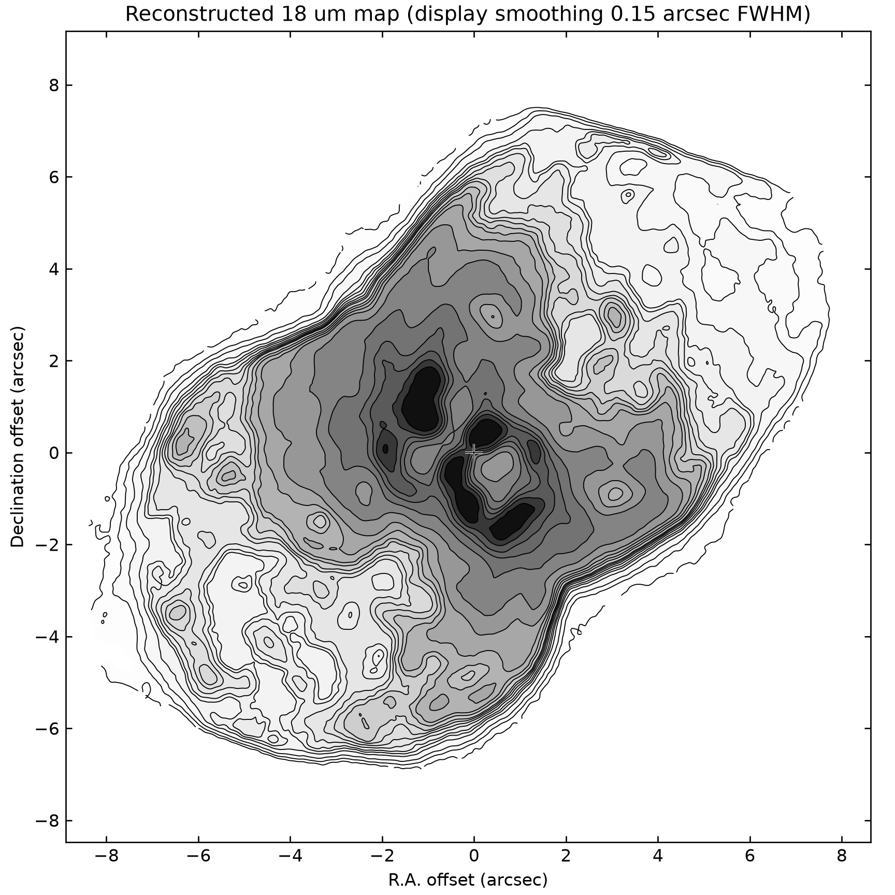
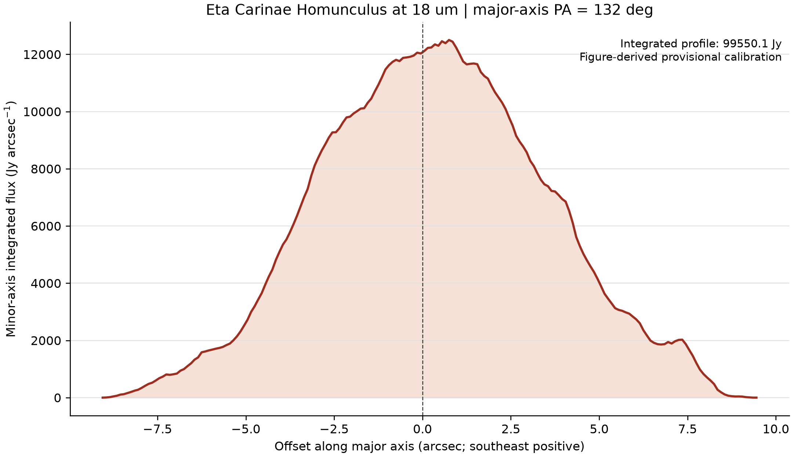

# Eta Carinae 18 Micron Homunculus Reconstruction

## Session summary, methodology, algorithms, and products

**Date:** 2026-09-14  
**Source:** Smith (2003), especially Figure 1e and the left panel of Figure 3  
**Status:** Provisional figure-derived morphology and flux-scale estimate; not archival calibrated photometry or an astrometric solution

## 1. Objective

The goal was to reconstruct a continuous two-dimensional 18 micron surface-brightness map of the Eta Carinae Homunculus. Figure 3 supplies the high-resolution color morphology but no direct flux scale, while Figure 1e supplies published 18 micron contours in Jy arcsec^-2. We combined their complementary information and then integrated the reconstructed map across the Homunculus minor axis to obtain power per unit angle along the major axis in Jy arcsec^-1.

## 2. Source information

- Figure 3 left-panel channels: 18.0 micron in red, 12.5 micron in green, and 8.8 micron in blue.
- Published Figure 1e contour levels: 30, 60, 120, 200, 250, 300, 375, 450, 520, 590, 750, 870, 970, 1050, 1200, 1350, 1450, 1550, 1700, 2000, 2500, and 3200 Jy arcsec^-2.
- Figure 1e was extracted from embedded PDF raster xref 35.
- Figure 3 was extracted from embedded PDF raster xref 69; the working native crop is 680 x 676 pixels.
- Figure 1e contour paths were extracted from PDF drawings 212 through 252. Individual segments were retained as independent segments, avoiding artificial connectors between unrelated paths.

## 3. Image preparation

### 3.1 Stellar reference

The stellar cross in Figure 1e was identified programmatically from the unique intersecting long horizontal and vertical vector segments in drawing 252. The embedded Figure 1e raster has a negative vertical PDF placement transform, so its extracted rows are reversed before raster sampling and side-by-side display; this aligns it with the Figure 1e vector coordinates and Figure 3. The Figure 3 stellar marker was detected from the maximum dark row and column projections in a restricted central region. The resulting Figure 3 reference position is pixel `(344.5, 350.5)`.

### 3.2 Marker removal

The printed Figure 3 stellar plus sign is not astronomical emission. A small rectangular marker mask was inpainted with OpenCV's Telea algorithm. The central region remains inside the scientific footprint; only the overprinted marker is replaced.

### 3.3 Scientific footprint

The source footprint was derived on the native Figure 3 raster from HSV saturation and value thresholds, morphological closing, the connected component nearest the star, binary dilation, and hole filling. Known annotation regions were excluded. No footprint pixels touched the excluded two-pixel image border in the final reconstruction.

## 4. Spatial calibration

An earlier nominal 13 arcsec full-frame mapping compressed the visible Homunculus to approximately +/-4.5 arcsec and was rejected.

### 4.1 Figure 1e scale

The labeled major ticks in Figure 1e are separated by 21.14 PDF user units per 2 arcsec. This gives a Figure 1e raster scale of:

`0.0610047292 arcsec pixel^-1`.

### 4.2 Figure 3 border-tick detection

The Figure 3 tick centers are measured from the raster rather than stored as fixed coordinates. For each of the top, bottom, left, and right borders, the algorithm:

1. Converts RGB to grayscale.
2. Selects a narrow border strip.
3. Forms a perpendicular-stroke contrast response while suppressing the continuous frame.
4. Searches period and phase for a regular comb between 36 and 41 pixels.
5. Refines every predicted center to the local response maximum.
6. Fits a linear regular sequence and records centers, strengths, residuals, and RMS residual.
7. Combines opposing edges with residual-based weights, separately for X and Y.

Measured spacings are:

| Edge | Spacing (pixels/tick) | RMS residual (pixels) |
|---|---:|---:|
| Top | 38.7662 | 0.490 |
| Bottom | 38.7574 | 0.298 |
| Left | 38.2559 | 0.330 |
| Right | 38.2559 | 0.305 |

Under the adopted assumption of 1 arcsec per regular Figure 3 tick interval, the native angular scales are:

- X: `+0.0257999733 arcsec pixel^-1`
- Y: `-0.0261397709 arcsec pixel^-1`

The X/Y difference is retained rather than averaged. The Figure 1e-to-Figure 3 contour transfer is star-anchored, has zero rotation, and uses independent scale ratios of 2.364527 in X and 2.333790 in Y.

The 1 arcsec assignment is an inference from the publication's tick hierarchy and plausible field size; the Figure 3 ticks themselves are unlabeled. Alternatives of 0.5 or 2 arcsec per interval would imply fields of roughly 8.8 or 35.2 arcsec. Therefore this calibration must not be treated as independent astrometry.



## 5. Morphology and flux calibration

### 5.1 Contour grouping

Grayscale samples were taken normal to each extracted Figure 1e vector segment. A contiguous dynamic-programming partition grouped the 41 drawing objects into the 22 published contour levels while penalizing violations of the expected monotonic relation between darker Figure 1e shading and higher flux.

### 5.2 Channel selection

Three predictors were compared by leave-one-contour-level-out cross-validation:

| Predictor | RMSE (Jy arcsec^-2) |
|---|---:|
| Red channel | 256.61 |
| Luminance | 288.64 |
| Best constrained RGB mixture | 256.61 |

The constrained RGB optimum was exactly `[1, 0, 0]`, so the red-only model was retained. This is also physically consistent with the published Figure 3 channel assignment.

### 5.3 Monotone transfer function

Red-channel values sampled along the transferred contours were paired with their assigned published flux levels. A pooled-adjacent-violators isotonic fit produced a nondecreasing piecewise-linear red-to-flux mapping. The map is evaluated by interpolation between fitted anchors.

- Emission below 30 Jy arcsec^-2 is unsupported by the contour data.
- High signals are held at the highest supported effective anchor and flagged as clipped/lower-bound pixels.
- The highest supported effective anchor and map maximum are approximately 2253.08 Jy arcsec^-2.
- Consequently, the published 2500 and 3200 Jy arcsec^-2 contours are absent from both the scientific map and display-smoothed plot.

The final science map remains on the native 676 x 680 Figure 3 raster. There is no spatial warp or interpolation of the map itself. Its angular center bounds are X `[-8.8881, 8.6301]` arcsec and Y `[-8.4824, 9.1620]` arcsec.



## 6. Contour visualization

The contour plot uses the published levels up to the available map maximum. A mask-normalized Gaussian with 0.15 arcsec FWHM is used only for display. The FITS and NPZ science arrays are unchanged. The standalone contour map shows the full native field; the comparison plot applies the exact Figure 1e angular limits to both panels.



## 7. Major-axis profile

The Homunculus major axis was taken to have position angle `PA = 132 degrees` east of north, with positive distance toward the southeast lobe. This angle was adopted from the standard Homunculus orientation; it was not fitted from this map.

For each native pixel at offsets `(x, y)`, its coordinate along the major axis is

`s = -x sin(PA) + y cos(PA)`.

The displayed horizontal offset increases to the right while astronomical east increases to the left, hence the negative `x` term. Pixels are accumulated in 0.1 arcsec bins without rotating or interpolating the image. If `I_i` is in Jy arcsec^-2 and the native pixel area is `A_pix`, the profile in a bin of width `Delta s` is

`P(s) = sum_i(I_i A_pix) / Delta s`,

which has units of Jy arcsec^-1. This area-conserving construction satisfies

`sum P(s) Delta s = sum I_i A_pix`.

The resulting integrated profile flux is `99550.08 Jy`. Because the input map is figure-derived and its low-level background below the 30 Jy arcsec^-2 contour is unsupported, this total should also be treated as provisional.



## 8. Validation

- Tick detection uses live raster evidence on all four borders.
- Opposing-edge spacing differences are 0.0088 pixel in X and effectively zero in Y.
- Tick-sequence RMS residuals are 0.30-0.49 pixel.
- The stellar reference maps exactly to `(0, 0)` in angular coordinates.
- FITS and NPZ science maps are exactly equal and have native shape 676 x 680.
- The normalized weight map sums to exactly 1.
- No spatial interpolation is applied to the science map.
- The major-axis profile conserves integrated flux numerically.
- The automated test suite reports `1 passed`; the remaining warnings are PyMuPDF/SWIG deprecation warnings.
- An independent final verification returned PASS for the corrected spatial calibration and provisional labeling.

## 9. Files created

### Primary scripts

- `reconstruct_homunculus_map.py`: extraction, cleaning, contour grouping, flux calibration, footprint construction, raster tick calibration, WCS metadata, and diagnostics.
- `plot_reconstructed_contours.py`: angular contour and matched Figure 1e comparison plots.
- `plot_major_axis_profile.py`: area-conserving minor-axis integration and major-axis profile export.
- `tests/test_reconstruction.py`: deterministic reconstruction, tick, WCS, map identity, and profile-conservation checks.
- `requirements.txt`: Python dependencies.

### Primary scientific products

- `outputs/i18_map.fits`: native reconstructed 18 micron surface-brightness map in Jy arcsec^-2 with linear offset metadata.
- `outputs/i18_map.npz`: map, normalized weights, footprint, clipping mask, model red image, masks, segments, and registration matrices.
- `outputs/i18_major_axis_profile.csv`: major-axis offset and minor-axis-integrated flux in Jy arcsec^-1.
- `outputs/i18_major_axis_profile.json`: profile assumptions, bin width, orientation, method, status, and integrated flux.
- `outputs/contours.json`: published levels and inferred drawing-group assignments.
- `outputs/decisions.json`: detailed machine-readable provenance, measurements, calibration anchors, and limitations.
- `outputs/DECISIONS.md`: concise human-readable decisions.

### Figures and diagnostics

- `outputs/i18_contours_angular.png` and `.pdf`: reconstructed contour map.
- `outputs/comparison_fig1e_reconstruction.png`: original and reconstruction at matched angular limits.
- `outputs/i18_major_axis_profile.png` and `.pdf`: minor-axis-integrated profile.
- `outputs/diag_tick_residuals.png`: measured border-tick fit residuals.
- `outputs/diag_registration_before_after.png`: old contracted mapping versus direct border-tick transform.
- `outputs/diag_fig1e_grouping.png`: contour drawing grouping.
- `outputs/diag_calibration_robust_spreads.png`: red-signal to flux calibration.
- `outputs/diag_cv_model_comparison.png`: red, luminance, and constrained-RGB cross-validation.
- `outputs/diag_marker_removal.png`: stellar marker mask and inpainting.
- `outputs/diag_footprint_overlay.png`: source footprint.
- `outputs/diag_reconstructed_contours_overlay.png`: reconstructed native angular map diagnostic.
- `outputs/fig3_left_rgb_cleaned.png`, `footprint_mask.png`, `clipped_mask.png`, and `i18_map_peak_norm.png`: intermediate visual products.

## 10. Reproduction

```bash
python reconstruct_homunculus_map.py --output outputs
python plot_reconstructed_contours.py --outputs outputs
python plot_major_axis_profile.py --outputs outputs
pytest -q
```

Python dependencies are PyMuPDF, NumPy, SciPy, OpenCV, Astropy, Matplotlib, and Pillow.

## 11. Limitations

- The product is reconstructed from publication figures, not detector-level or archival calibrated data.
- Figure 1e contour-to-drawing grouping is inferred rather than independently labeled.
- The Figure 3 angular tick interval is inferred because the raster ticks are unlabeled.
- Flux below 30 Jy arcsec^-2 is unconstrained.
- Saturated/high-signal values are lower bounds at the highest supported anchor.
- No formal uncertainty map has been propagated through contour grouping, transfer-function fitting, spatial-scale inference, or the major-axis profile.
- Fine-scale structure may contain publication rasterization, color-transfer, compression, and inpainting artifacts.
